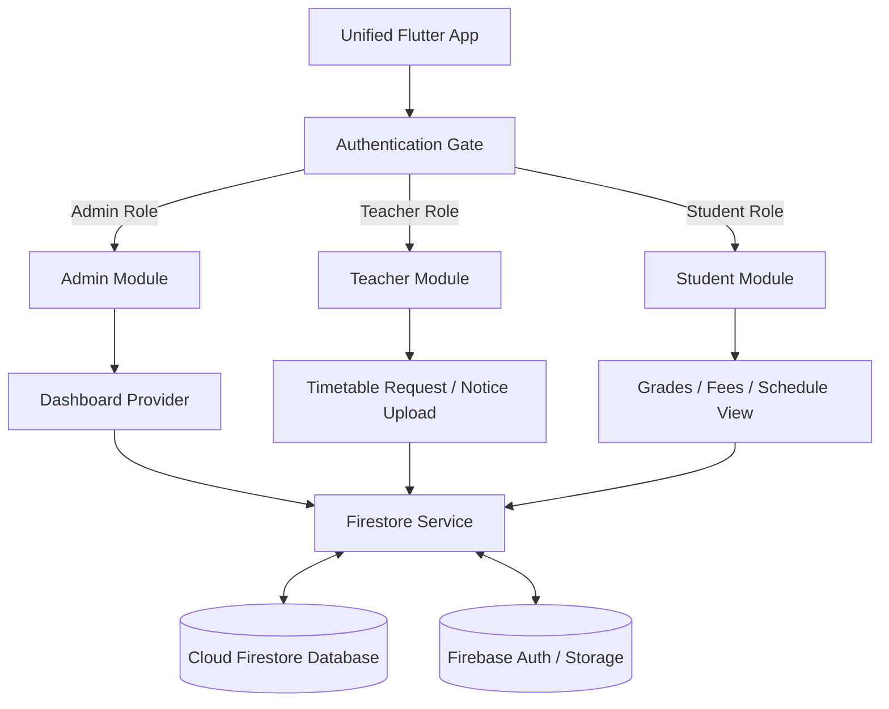

<p align="center">
  
</p>

<p align="center">
  
  
  
  
</p>

---

# Smart School Management System (Unified Ecosystem)

A comprehensive, multi-tenant administrative and academic management platform built using **Flutter** and **Firebase**. The system consolidates the entire school lifecycle into a single, unified database architecture, offering tailored, role-based dashboards for **Administrators**, **Teachers**, and **Students/Parents**.

By unifying all roles into a single application, the system simplifies deployment, keeps the state synchronized in real-time, and reduces configuration overhead across different target platforms (Web, Android, iOS, and Windows).

## 📐 Architecture & Data Flow

The project follows a modular, repository-pattern architecture. State is managed reactively via **ChangeNotifier Providers**, ensuring decoupling between UI widgets, background services, and backend Firestore streams.



---

## 📂 Codebase Structure

The application codebase is structured cleanly into modular domains to support cross-functional development:

* **`/lib/auth`**: Authentication flow services, session management, and route guarding.
* **`/lib/core`**: Global widgets, theme definitions, and utility classes.
* **`/lib/models`**: Strongly-typed data models mapping Firestore schemas (e.g., `TeacherModel`, `NoticeModel`).
* **`/lib/services`**: Core operational integrations, including authentication and Firestore read/write streams.
* **`/lib/modules/admin`**: Administrative control panels, global settings, notifications, and institution roll-over logic.
* **`/lib/modules/teacher`**: Weekly scheduling, timetabling requests, grade management, and notice publishing.
* **`/lib/modules/student`**: Financial ledger tracking, grade view dashboards, consultation schedules, and feed readers.

---

## 🔑 Core Modules & Features

### 1. Administrative Panel (`modules/admin`)
Designed for central institution control with administrative capabilities:
* **Ecosystem Configuration:** Modify school details, manage academic terms, and configure global registration parameters.
* **Real-time Metrics:** Consolidated dashboard visualizing institution status (total registration stats, active schedules, and financial overviews using custom `FL Chart` integrations).
* **Notification Dispatcher:** Send announcements and broadcast push notifications or emails (integrated with `mailer` package) to teachers, students, or entire grades.
* **Access Control:** Oversee user registrations and credentials, and approve timetable adjustment requests.

### 2. Educator Interface (`modules/teacher`)
Tailored workspace focusing on day-to-day academic operations:
* **Timetable Coordination:** View interactive weekly schedules and submit rescheduling or replacement requests directly to administrators.
* **Notice Board Publisher:** Compose and upload documents, announcements, and study materials directly to students.
* **Student Tracking:** Access course rosters and manage student performance.

### 3. Student & Guardian Portal (`modules/student`)
A responsive interface for academic and financial tracking:
* **Performance Dashboard:** Access grades, term evaluations, and attendance statistics.
* **Financial Ledger:** View billing history, check pending fees, and download receipt records.
* **Academic Timetables:** View updated daily class schedules, exam schedules, and teacher consultation hours.
* **Notice Feed:** Real-time stream of official announcements, notices, and resource materials.

---

## 🛠️ Technology Stack & Dependencies

* **Frontend Framework:** Flutter SDK (Stable Channel, Dart 3.7.0+)
* **State Management:** Provider pattern for reactive state propagation.
* **Responsive Layouts:** `flutter_screenutil` for resolution-independent scaling across mobile, web, and desktop views.
* **Database & Auth:** Firebase Suite:
  * **Firebase Auth:** Email-based token authentication with role claims.
  * **Cloud Firestore:** Real-time database collections with composite query index configurations.
  * **Firebase Storage:** Document and media asset hosting for notices and reports.
* **Analytics & UI Elements:** 
  * `fl_chart` for admin dashboard analytics.
  * `flutter_staggered_animations` for smooth, native list and grid transitions.
  * `cached_network_image` and `shimmer` for optimized resource loading states.
* **Communication:** `mailer` and `http` for custom email broadcasts and external API interactions.

---

## 🚀 Quick Start & Installation

### Prerequisites
* Flutter SDK (`^3.7.0`)
* Java Development Kit (JDK 17)
* Firebase CLI installed and configured

### 1. Installation & Dependency Fetching
Clone the repository and install all Dart dependencies:
```bash
git clone https://github.com/muhammadasad-dev118/Smart-School-Management-Mobile-App.git
cd Smart-School-Management-Mobile-App
flutter pub get
```

### 2. Firebase Configuration Setup
Initialize Firebase client configurations:
```bash
flutterfire configure
```
Make sure your Firebase project has **Authentication** (Email/Password), **Firestore Database**, and **Cloud Storage** enabled.

### 3. Running the App
* **Development (Mobile):**
  ```bash
  flutter run
  ```
* **Development (Web Canvaskit Renderer):**
  ```bash
  flutter run -d chrome --web-renderer canvaskit
  ```
* **Release Build (Web):**
  ```bash
  flutter build web --web-renderer canvaskit --release
  ```

---

## 🔧 Critical Troubleshooting & Environment Notes

During development and testing, keep the following environment-specific configurations in mind:

### 1. NDK Toolchain Path Resolution (Android Builds)
If you encounter compiler warnings or compilation failures on Android (such as `CXX1429` errors), verify that your Android SDK and NDK configurations are aligned:
1. Ensure the NDK path is correctly defined in `android/local.properties`:
   ```properties
   ndk.dir=C:/Users/YOUR_USER/AppData/Local/Android/Sdk/ndk/YOUR_NDK_VERSION
   ```
2. Verify that `android/app/build.gradle.kts` matches the target SDK and NDK versions.

### 2. Web Runtime Stability (`JSNull` Exception Checks)
To prevent unexpected `JSNull` type errors in the Flutter Web environment during fast refresh or dashboard component swapping:
* Always verify state mounting (`if (!mounted) return;`) before calling listeners or calling `notifyListeners()` from asynchronous tasks inside Providers.
* Unsubscribe active StreamSubscriptions inside your widgets' `dispose()` lifecycle method.

### 3. Firestore Composite Index Requirement
For the Teacher Timetable module to load records successfully, Cloud Firestore requires a Composite Index on the `timetable_requests` collection. If query calls return a `failed-precondition` error, ensure you have set up the following index in your Firebase Console:
* **Collection ID:** `timetable_requests`
* **Fields:** 
  * `teacherId` (Ascending)
  * `createdAt` (Descending)
* **Scope:** Collection
